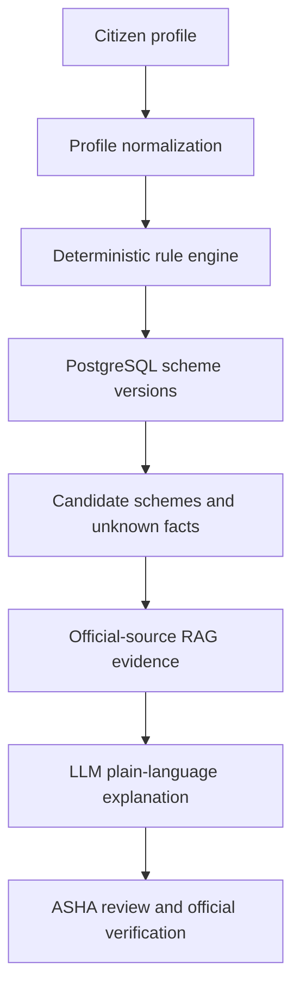

# AarogyaSahayak Government Health Scheme Knowledge Base

Version: `2026-08-25.1`  
Research verification date: `2026-08-25`  
Initial jurisdiction: India, with Maharashtra as the first state implementation

This package is an implementation-ready starting point for a source-backed scheme and health-program knowledge base. It is intentionally conservative: it never treats an AI answer, an ABHA number, a demographic similarity, or a myScheme result as official proof of eligibility.

## 1. Executive decision

Use a hybrid design:

1. **PostgreSQL is the system of record** for schemes, immutable scheme versions, authorities, jurisdictions, benefits, documents, application channels, source assertions, freshness and audit history.
2. **A deterministic rule engine** evaluates a patient profile using three-valued logic: `TRUE`, `FALSE`, or `UNKNOWN`.
3. **Neo4j is a derived eligibility projection**, useful for explainable traversal across schemes, rules, benefits, facilities and help points. It must be rebuildable from PostgreSQL and must not become a second source of truth.
4. **Milvus/RAG stores official guidance and notification chunks** for evidence retrieval and plain-language explanations. It must not create or modify eligibility rules.
5. **The LLM explains only a structured result** and cites the supporting source assertions. It cannot issue `VERIFIED_ELIGIBLE`, cannot invent missing values and cannot turn `UNKNOWN` into `FALSE`.
6. **Official verification adapters** such as PM-JAY BIS or PMMVY status checks are separate integrations and may be used only through documented, authorized access.

Recommended flow:



## 2. Do not combine these concepts

| Concept | Meaning in AarogyaSahayak | Example |
|---|---|---|
| Relevance | The program may help this person | A pregnant woman is relevant to JSSK and PMSMA |
| Eligibility screening | Published rules appear to be met | A Maharashtra resident appears relevant to MJPJAY |
| Official verification | A government registry, official or authorized operator confirms entitlement | PM-JAY family is found and authenticated in BIS |
| Application/access | Where the citizen actually receives the benefit or service | PMMVY portal, Anganwadi/ASHA, or an empanelled hospital |
| ABHA | Digital health identity and record-linking account | A 14-digit health identifier |
| Facility registry | Verified facility identity/metadata | ABDM Health Facility Registry |

**ABHA is not PM-JAY eligibility.** The [ABDM citizen page](https://abdm.gov.in/citizens) describes ABHA as a digital health identifier. PM-JAY entitlement is separately identified and authenticated through the [Beneficiary Identification System](https://beneficiary.nha.gov.in/).

## 3. Ranked official source hierarchy

The user's suggested hierarchy is improved here: a current Government Resolution or scheme-owner guideline is more authoritative than an aggregator, even when it is a PDF.

### Tier 1 — controlling authority and current legal/operational source

- Scheme-owning ministry, department, National Health Authority, State Health Agency, or State Government.
- Current Government Resolution, operational guideline, notification, FAQ or application manual issued by that authority.
- Use for eligibility, benefits, required documents, effective dates and application rules.

### Tier 2 — official application and verification systems

- PM-JAY BIS/Ayushman beneficiary system, PMMVY portal, empanelled-hospital systems, state assistance portals and authorized operator systems.
- Use for `VERIFIED_ELIGIBLE`, application state and official facility/network confirmation.
- Do not scrape or automate authenticated systems without documented permission.

### Tier 3 — official discovery aggregators

- [myScheme](https://www.myscheme.gov.in/) and [India.gov.in](https://www.india.gov.in/my-government/schemes).
- Use for discovery, cross-checking, translated summaries and official link-outs.
- Do not treat aggregator text as controlling when the owning department has a newer guideline.

### Tier 4 — official state and district implementation pages

- State Public Health Department, NHM state portal, State Health Assurance Society and official district pages.
- Use for local delivery channels, helplines, facility access, state-specific eligibility and implementation changes.
- District pages should be cross-checked against state-level orders where a rule or benefit amount is material.

### Tier 5 — discovery only

- Search engines and non-authoritative references may identify a candidate source, but no rule is published until the final cited source is official.
- Private blogs, social media, commercial insurer sites, Wikipedia, Quora and videos are never eligibility authorities.

## 4. Best authoritative source matrix

| Rank | Source | Authority / level | Information coverage | API/download status | Reliability | Recommended use |
|---:|---|---|---|---|---|---|
| 1 | [Scheme owner guidelines and notifications](https://mohfw.gov.in/) | Relevant ministry/department; Central or State | Eligibility, benefits, documents, application rules, effective dates | PDFs/pages are public; machine API varies by authority | HIGH | Primary source for every material rule; store document hash and page/section |
| 2 | [NHA PM-JAY](https://lms.nha.gov.in/local/staticpage/view.php?page=aboutpmjay) | National Health Authority, MoHFW; Central | PM-JAY coverage, features, entitlement basis, portability | Public information; no open beneficiary-data API verified | HIGH | PM-JAY program facts and source assertions |
| 3 | [PM-JAY BIS](https://beneficiary.nha.gov.in/) | NHA; Central/State Health Agencies | Official beneficiary search, authentication/e-KYC, Ayushman Card | Authenticated system; authorization required for integration | HIGH | Official verification only; never replace with local screening |
| 4 | [NHA hospital empanelment system](https://hem.nha.gov.in/) | NHA; Central/State | Network hospital empanelment | Public portal; no unrestricted bulk API verified | HIGH | Confirm empanelled provider/network status |
| 5 | [SPNIWCD PMMVY](https://www.spniwcd.wcd.gov.in/pradhan-mantri-matru-vandana-yojna) and [FAQ](https://www.spniwcd.wcd.gov.in/pradhan-mantri-matru-vandana-yojna/faqs) | Ministry of Women and Child Development; Central | PMMVY eligibility, benefits, documents, milestones, application | Public pages/documents; official portal handles application | HIGH | Primary PMMVY rule source |
| 6 | [National Health Mission](https://nhm.gov.in/) | MoHFW; Central | Maternal, child and public-health program pages and guidelines | Public pages/PDFs; no universal scheme API | HIGH | JSY, JSSK, RBSK, SUMAN and program guidelines |
| 7 | [MoHFW](https://mohfw.gov.in/) and [DGHS](https://dghs.mohfw.gov.in/) | MoHFW/DGHS; Central | National programs, policies, technical guidelines, services | Public pages/PDFs; program-specific systems vary | HIGH | NCD, elderly, mental health, leprosy, palliative care and financial-support rules |
| 8 | [Maharashtra Public Health Department](https://phd.maharashtra.gov.in/en/) | Government of Maharashtra; State | State health schemes/programs, orders, helplines, facilities | Public pages/documents; permission may be required to reproduce content | HIGH | Primary Maharashtra implementation source |
| 9 | [NHM Maharashtra](https://nhm.maharashtra.gov.in/en/schemes-programmes/) | Government of Maharashtra; State | Maharashtra delivery rules for JSY/JSSK/PMSMA, maternal/child and disease programs | Public pages/PDFs; no open bulk API verified | HIGH | Local eligibility, workflow and ASHA access instructions |
| 10 | [State Health Assurance Society](https://phd.maharashtra.gov.in/en/organization/state-health-assurance-society_1/) | Government of Maharashtra; State | MJPJAY/PM-JAY state assurance governance | No unrestricted beneficiary API verified | HIGH | State ownership, escalation and official verification routing |
| 11 | [ABDM](https://abdm.gov.in/) / [ABHA](https://abha.abdm.gov.in/abha/v3) | NHA; Central | Digital identity, consented health-record exchange | Sandbox/API access requires onboarding and approval | HIGH for identity | Identity/interoperability only; never scheme eligibility |
| 12 | [ABDM Health Facility Registry](https://abdm.gov.in/health-facilities) | NHA; Central | Verified facility registry across systems of medicine | Sandbox/onboarding applies for integrations | HIGH for registry | Facility metadata; not proof of PM-JAY empanelment |
| 13 | [myScheme](https://www.myscheme.gov.in/) | NeGD/DIC, MeitY with ministries; Central aggregator | Central and State scheme discovery, eligibility questionnaire, benefits, documents, application steps and link-outs | No unrestricted public scheme-data API was verified; API access should be sought through approved channels such as API Setu | MEDIUM-HIGH | Discovery and cross-check; not final legal authority |
| 14 | [India.gov.in schemes](https://www.india.gov.in/my-government/schemes) | NIC, MeitY; Central portal | Official directory and links; some content is sourced from myScheme | No scheme API verified from the portal | MEDIUM-HIGH | Discovery, directory and cross-check |
| 15 | [API Setu](https://apisetu.gov.in/) / [directory](https://directory.apisetu.gov.in/) | NeGD/DIC, MeitY; Central | Authorized government APIs and metadata | Valid credentials and approved use are required | HIGH when an issuer API exists | Only use a listed, documented API; never invent one |
| 16 | [data.gov.in](https://www.data.gov.in/) | Government of India Open Data platform | Non-sensitive downloadable datasets/APIs where published | Dataset-specific GODL terms and API availability | HIGH for published datasets | Analytics and facility/program aggregates, not individual eligibility unless explicitly supported |

### myScheme conclusion

myScheme is the best **national discovery layer**, but it should not be the only or controlling source. Its official FAQ states that scheme pages can include eligibility, benefits, documents and application procedures, and that it redirects users to the responsible department's application page. The same FAQ tells users to consult the ministry/department when discrepancies occur. Its disclaimer also says the platform content is not a legal reproduction. Therefore:

- Use it to discover candidate schemes and compare your structured fields.
- Store its scheme page as a secondary source assertion.
- Link to it without framing/shortening and without implying partnership.
- Do not assume a public API exists. Use API Setu only when a documented API and authorization are available.
- Do not scrape at scale until the applicable terms, rate limits and permission are confirmed.

### Legal and technical reuse rule

For the hackathon, store **your own structured facts and short evidence excerpts**, plus the official URL, section/page locator, content hash and verification date. Do not mirror entire government websites or copyrighted PDFs. Maharashtra's website policy permits reproduction only after proper permission and requires accurate reproduction and source acknowledgement. myScheme's URL-hosting terms restrict framing, shortening, misleading presentation and commercial promotion. API Setu requires valid credentials and an authorized use case.

## 5. Recommended first 28 records

`schemes.json` contains these records. Only programs with sufficiently clear published rules are enabled for deterministic eligibility in the MVP. Others are stored as service discovery or `MANUAL_REVIEW` records.

| # | Record | Type | Primary official source | Screening vs verification | Access |
|---:|---|---|---|---|---|
| 1 | Ayushman Bharat PM-JAY | Insurance/assurance | [NHA overview](https://lms.nha.gov.in/local/staticpage/view.php?page=aboutpmjay) | Local relevance screening; official entitlement only through BIS | [BIS/Ayushman](https://beneficiary.nha.gov.in/) and empanelled hospital |
| 2 | Integrated MJPJAY + PM-JAY, Maharashtra | State assurance | [Maharashtra official page](https://zpdharashiv.maharashtra.gov.in/en/scheme/pradhan-mantri-jan-arogya-yojana-and-mahatma-jyotirao-phule-jan-arogya-yojana/) | Maharashtra relevance; official beneficiary/network verification required | Arogyamitra/network hospital; helpline 155388 |
| 3 | PMMVY 2.0 | Maternity cash benefit | [MWCD/SPNIWCD FAQ](https://www.spniwcd.wcd.gov.in/pradhan-mantri-matru-vandana-yojna/faqs) | Deterministic pre-screening; State Nodal Officer approval and portal checks required | [PMMVY portal](https://pmmvy.wcd.gov.in/), AWW/ASHA |
| 4 | Janani Suraksha Yojana | Maternity cash assistance | [NHM JSY](https://nhm.gov.in/index1.php?lang=1&level=3&lid=309&sublinkid=841) and [Maharashtra JSY](https://nhm.maharashtra.gov.in/en/scheme/rch-janani-suraksha-yojana-jsy/) | HPS rule screening for Maharashtra; RCH/health-facility verification | ANM/ASHA and government/accredited facility |
| 5 | JSSK | Service entitlement | [NHM JSSK](https://nhm.gov.in/index1.php?lang=1&level=3&lid=308&sublinkid=842) and [Maharashtra JSSK](https://nhm.maharashtra.gov.in/en/scheme/rch-janani-shishu-suraksha-karyakram-jssk/) | Service relevance, not cash-scheme eligibility | Public health institution; Maharashtra transport 102 |
| 6 | PMSMA | Maternal service program | [PMSMA](https://pmsma.mohfw.gov.in/) / [Maharashtra implementation](https://nhm.maharashtra.gov.in/en/scheme/pradhan-mantri-surakshit-matrutva-abhiyan/) | Pregnancy/service screening; facility confirms service | Government-designated facility on fixed day |
| 7 | SUMAN | Maternal/newborn service assurance | [NHM maternal guidelines](https://nhm.gov.in/index1.php?lang=1&level=3&lid=377&sublinkid=839) | Service entitlement; no local eligibility invention | Public health facility and grievance channel |
| 8 | RBSK 2.0 | Child screening/treatment program | [NHM RBSK](https://nhm.gov.in/index4.php?lang=1&level=0&lid=773&linkid=499) | Age/service relevance; clinical screening confirms pathway | Delivery point, Anganwadi, government school, DEIC |
| 9 | Universal Immunisation Programme / U-WIN | Immunization service/registry | [U-WIN](https://uwin.mohfw.gov.in/home) | Schedule due-status, not scheme eligibility | Public vaccination session/facility |
| 10 | Ayushman Arogya Mandir | Primary-care service | [AAM portal](https://aam.mohfw.gov.in/) | Location/service relevance | Nearest AAM/PHC/SC |
| 11 | NTEP | TB public-health program | [TB India](https://tbcindia.mohfw.gov.in/) | Suspected/diagnosed case pathway; program enrollment is official | Public/private notified TB care, Nikshay pathway |
| 12 | Nikshay Poshan Yojana | TB nutrition DBT | [NTEP guidelines](https://tbcindia.mohfw.gov.in/guidelines/) | Diagnosed/notified TB relevance; Nikshay/DBT verification required | TB program staff/Nikshay; exact current amount must follow current order |
| 13 | National AIDS Control Programme | HIV prevention/testing/treatment program | [NACO](https://naco.gov.in/) | Service pathway, not general scheme eligibility | ICTC/ART/SACS services |
| 14 | NP-NCD/NPCDCS | NCD screening and care program | [NHM NCD page](https://nhm.gov.in/nammamihaan/index1.php?lang=1&level=2&lid=604&sublinkid=1048) | Age/risk/service relevance; clinical confirmation required | AAM/PHC/CHC/District Hospital |
| 15 | NPHCE | Elderly healthcare program | [DGHS NPHCE](https://dghs.mohfw.gov.in/national-programme-for-the-health-care-of-the-elderly.php) | Elderly/service relevance | PHC/CHC/District Hospital geriatric services |
| 16 | Tele-MANAS/NMHP | Mental-health service | [DGHS NMHP](https://dghs.mohfw.gov.in/national-mental-health-programme.php) | Universal service, not eligibility-based | 14416 or 1800-89-14416 |
| 17 | NLEP | Leprosy program/free services | [DGHS NLEP](https://dghs.mohfw.gov.in/nlep.php) | Suspected/diagnosed pathway | Public health facility |
| 18 | PM National Dialysis Programme | Dialysis service program | [PMNDP](https://pmndp.mohfw.gov.in/en) | Clinical need and local capacity; facility confirms access | Participating public/PPP dialysis unit |
| 19 | National Sickle Cell Elimination Mission | Screening/treatment program | [Maharashtra official page](https://phd.maharashtra.gov.in/en/scheme/sickle-cell/) | Age/district/service relevance; test confirms disease/trait | PHC/RH/WH/DH in participating districts |
| 20 | National Programme for Palliative Care | Palliative-care service | [DGHS NPPC](https://dghs.mohfw.gov.in/nppc.php) / [Maharashtra NPPC](https://phd.maharashtra.gov.in/en/scheme/national-program-for-palliative-care/) | Condition/service relevance; clinical referral | District Hospital/CHC/PHC/HWC/home-care team |
| 21 | National Programme for Prevention and Control of Deafness | Hearing-care program | [DGHS program page](https://dghs.mohfw.gov.in/national-programme-for-prevention-and-control-of-deafness.php) | Symptom/service relevance | Public referral pathway |
| 22 | eSanjeevani | Telemedicine service | [eSanjeevani](https://esanjeevani.mohfw.gov.in/) | Service availability, not scheme eligibility | Citizen app or assisted HWC/PHC teleconsultation |
| 23 | Rashtriya Arogya Nidhi | Financial medical assistance | [MoHFW poor-patient support](https://www.mohfw.gov.in/major-programmes/poor-patients-financial-support) | `MANUAL_REVIEW` until current controlling guideline is parsed and approved | Designated government hospital/official application process |
| 24 | Health Minister's Discretionary Grant | Financial medical assistance | [Official HMDG guideline PDF](https://www.mohfw-dohfw.gov.in/static/uploads/2025/11/302fdbb2ed4f7c339ff5ee25e04216f9.pdf) | `MANUAL_REVIEW`; committee/authority decision required | Route defined by current guideline |
| 25 | Navsanjivani – Matrutva Anudan, Maharashtra | Tribal maternity support | [NHM Maharashtra](https://nhm.maharashtra.gov.in/en/scheme/rch-navsanjivani-scheme/) | Pre-screen tribal district/current pregnancy/two living children; local verification required | Tribal-area health centre/ASHA/ANM |
| 26 | Chief Minister Vayoshree, Maharashtra | Elderly assistive/health support | [Social Justice Department](https://sjsa.maharashtra.gov.in/en/scheme/chief-minister-vayoshree-scheme/) | Deterministic pre-screen; district office verifies documents | Assistant Commissioner, Social Welfare |
| 27 | Maharashtra Charitable Hospital reserved-bed assistance | Access/support service | [Official helpdesk](https://charitymedicalhelpdesk.maharashtra.gov.in/Home/AboutUs) | Official income/document/hospital checks required | Helpdesk/hospital; 1800 123 2211 |
| 28 | PMBJP / Jan Aushadhi | Affordable-medicines service | [Official portal](https://janaushadhi.gov.in/) | No patient eligibility; medicine availability and prescription rules apply | Jan Aushadhi Kendra; 1800 180 8080 |

## 6. Exact data model

The SQL file implements the following relationships:

- `authority 1—N scheme`
- `scheme 1—N scheme_version`
- `scheme_version N—N jurisdiction`
- `scheme_version 1—N eligibility_rule_set`
- `eligibility_rule_set 1—N rule_node` using a tree (`parent_rule_node_id`)
- `scheme_version 1—N benefit`
- `scheme_version 1—N required_document`
- `scheme_version 1—N application_channel`
- `application_channel 1—N application_step`
- `scheme_version 1—N verification_method`
- `scheme_version 1—N help_point`
- `source_document 1—N source_assertion`
- every material rule/benefit/document/application statement N—N `source_assertion`
- `review_event` and `change_event` preserve the audit trail

Key design rules:

- `scheme_version` rows are immutable after publication.
- A new Government Resolution creates a new version; it does not overwrite old evidence.
- The active version is selected by effective dates and approval state.
- `source_assertion` stores a page/section locator and SHA-256 content hash.
- Every rule that can produce `NOT_ELIGIBLE` must have at least one Tier-1 assertion.
- Individual PII is not stored in the scheme knowledge graph.

## 7. Eligibility expression format

Example PMMVY-style expression:

```json
{
  "all": [
    {"field": "pregnancy_or_lactation", "operator": "equals", "value": true},
    {"field": "state", "operator": "not_in", "value": ["Odisha", "Telangana"]},
    {
      "any": [
        {"field": "social_category", "operator": "in", "value": ["SC", "ST"]},
        {"field": "net_family_income_annual", "operator": "lt", "value": 800000},
        {"field": "has_pmjay_beneficiary_proof", "operator": "equals", "value": true},
        {"field": "has_nfsa_ration_card", "operator": "equals", "value": true}
      ]
    }
  ]
}
```

Each atomic rule must also carry:

```json
{
  "source_assertion_id": "SRC-AST-PMMVY-ELIG-001",
  "missing_policy": "UNKNOWN",
  "effective_from": "2022-04-01",
  "effective_until": null,
  "official_verification_required": true
}
```

Supported operators should be allow-listed: `equals`, `not_equals`, `in`, `not_in`, `lt`, `lte`, `gt`, `gte`, `between`, `contains`, `exists`, `date_before`, `date_after`. Never execute free-form expressions from an LLM.

### Three-valued evaluation

- An atomic rule with a missing patient field returns `UNKNOWN`.
- `AND`: false if any child is false; true if all are true; otherwise unknown.
- `OR`: true if any child is true; false if all are false; otherwise unknown.
- `NOT`: true becomes false, false becomes true, unknown remains unknown.
- A hard `NOT_ELIGIBLE` is emitted only when a mandatory, current Tier-1 rule is conclusively false.

## 8. Output and communication statuses

Store relevance and eligibility separately.

| Status | When it may be shown | Required UI wording |
|---|---|---|
| `SERVICE_AVAILABLE` | Non-eligibility public service is relevant | “This service may be available through the listed public facility.” |
| `LIKELY_ELIGIBLE` | All published screening rules evaluate true, but official approval is still pending | “Based on the information provided, you appear to meet the published criteria. Official verification is required.” |
| `POTENTIALLY_ELIGIBLE` | A partial match exists or a state/local implementation rule still needs confirmation | “This may be relevant, but eligibility is not confirmed.” |
| `MORE_INFORMATION_REQUIRED` | At least one mandatory rule is unknown | Show the exact missing questions; do not guess |
| `OFFICIAL_VERIFICATION_REQUIRED` | A government registry/operator must confirm entitlement | Provide the official portal/help point |
| `VERIFIED_ELIGIBLE` | Only an authorized official response or verified document has confirmed eligibility | Show verification source, timestamp and reference; never infer this locally |
| `NOT_ELIGIBLE` | A current mandatory rule is conclusively false | Explain the failed published rule and link the source; allow human review |

For PM-JAY, a perfect demographic match can at most produce `OFFICIAL_VERIFICATION_REQUIRED`; only BIS or an authorized channel can establish official entitlement.

## 9. RAG boundaries

### Put into RAG

- Current official guidelines, Government Resolutions, notifications and FAQs.
- Application manuals, process documents and verified help-centre instructions.
- Scheme-owner pages and source documents with page/section metadata.
- Superseded documents, but mark them `superseded=true` and exclude them from default retrieval.

### Keep structured

- Eligibility predicates and logical grouping.
- Benefit amounts and caps.
- Required documents.
- Application channels and ordered steps.
- Effective dates, jurisdictions and verification methods.
- Helplines, official URLs and confidence/review states.

### Retrieval filter

Before vector search, filter by `scheme_id`, `scheme_version`, `authority`, `jurisdiction`, `effective_on`, `language`, `review_state=APPROVED`, and `superseded=false`. A vector match with no approved current version must not be shown as current eligibility evidence.

## 10. Freshness and governance

Required fields:

```text
last_checked_at
source_last_updated_at
effective_from
effective_until
scheme_version
source_document_version
content_sha256
review_due_at
review_state
supersedes_version_id
change_detected_at
approved_by
approved_at
```

Review cadence:

- Cash/insurance/financial assistance and exact eligibility: every 30 days.
- Maternity/child entitlement rules: every 60 days.
- Public-health program and service descriptions: every 90 days.
- Helplines, application URLs and facility links: weekly automated link check; monthly human review.
- Recheck immediately when a source hash, page title, update date, Government Resolution or notification changes.

Outdated flags:

- `STALE_WARNING`: review date exceeded but source still reachable.
- `SOURCE_CHANGED`: content hash changed.
- `SOURCE_UNAVAILABLE`: official source failed repeated checks.
- `SUPERSEDED`: a newer effective version exists.
- `RULE_BLOCKED`: no current Tier-1 assertion supports a material rule.

When any material rule is `SOURCE_CHANGED`, suppress `LIKELY_ELIGIBLE` and return `MORE_INFORMATION_REQUIRED` or `OFFICIAL_VERIFICATION_REQUIRED` until review.

## 11. Maharashtra MVP

Use these sources first:

1. [Maharashtra Public Health Department](https://phd.maharashtra.gov.in/en/) — state policy, schemes, government orders, facilities and helplines.
2. [NHM Maharashtra](https://nhm.maharashtra.gov.in/en/schemes-programmes/) — JSY, JSSK, PMSMA, RCH, tribal and ASHA implementation.
3. [State Health Assurance Society](https://phd.maharashtra.gov.in/en/organization/state-health-assurance-society_1/) — MJPJAY/PM-JAY governance.
4. [MJPJAY/PM-JAY Maharashtra official implementation page](https://zpdharashiv.maharashtra.gov.in/en/scheme/pradhan-mantri-jan-arogya-yojana-and-mahatma-jyotirao-phule-jan-arogya-yojana/) — current expanded coverage summary; verify against current state order before encoding future changes.
5. [Maharashtra health helplines](https://phd.maharashtra.gov.in/en/helpline/) — 108, 104, 102, 155388, 14416 and service routing.
6. [Maharashtra grievance redressal](https://phd.maharashtra.gov.in/en/grievance-redressal-2/) — district/circle/state escalation.
7. [Chief Minister Vayoshree](https://sjsa.maharashtra.gov.in/en/scheme/chief-minister-vayoshree-scheme/) — elderly support.
8. [Charitable Hospital Helpdesk](https://charitymedicalhelpdesk.maharashtra.gov.in/) — reserved-bed assistance, hospital list and patient tracking.
9. [CM Relief Fund](https://cmrf.maharashtra.gov.in/) — medical assistance; do not encode a decision rule until the current official procedure and documents are reviewed.

## 12. Hackathon minimum

Do not try to operationalize all 28 records. Demo 10 carefully:

1. PM-JAY
2. MJPJAY
3. PMMVY
4. JSY
5. JSSK
6. PMSMA
7. RBSK
8. U-WIN/UIP
9. NTEP/Nikshay Poshan
10. Chief Minister Vayoshree

Minimum implementation:

- PostgreSQL tables and one approved version per record.
- Deterministic rules for PMMVY, JSY, Navsanjivani and Vayoshree.
- `OFFICIAL_VERIFICATION_REQUIRED` adapters/links for PM-JAY and MJPJAY.
- `SERVICE_AVAILABLE` matching for JSSK, PMSMA, RBSK, UIP and NTEP.
- Neo4j projection for scheme-to-rule-to-benefit-to-help-point explanations.
- RAG limited to the cited official documents.
- Doctor/ASHA UI shows: relevance, status, matched rules, missing fields, benefits, documents, access steps, official verification button, source citations and last-verified date.
- A “Not medical advice / not official approval” safety notice.

### Canonical Sunita demo

For a 28-week pregnant Maharashtra resident, the engine should not simply print “eligible for all maternal schemes.” It should return:

- **JSSK:** `SERVICE_AVAILABLE` — public-facility maternal entitlements are relevant.
- **PMSMA:** `SERVICE_AVAILABLE` — antenatal service is relevant.
- **PMMVY:** `MORE_INFORMATION_REQUIRED` until child order, age, qualifying social/economic category, Aadhaar/account and milestone fields are known.
- **JSY (Maharashtra/HPS):** `MORE_INFORMATION_REQUIRED` until BPL/SC/ST status and delivery facility context are known.
- **MJPJAY:** `OFFICIAL_VERIFICATION_REQUIRED` with Arogyamitra/helpline and hospital route.
- **PM-JAY:** `OFFICIAL_VERIFICATION_REQUIRED` with BIS; ABHA must not change this result.

## 13. Package files

- `sources.json` — portal/source capability and reuse matrix.
- `schemes.json` — 28 classified, source-mapped records with a conservative MVP subset.
- `eligibility-rule.schema.json` — machine validation contract for rule trees.
- `postgresql_schema.sql` — normalized authoritative registry and audit schema.
- `neo4j_seed.cypher` — safe derived projection for the 10-record hackathon slice.
- `rag_manifest.json` — official-document ingestion metadata and approval gates.

This dataset is a verified engineering starting point, not an official government eligibility decision. Production use requires an assigned human reviewer, current Government Resolution review, security/privacy review, and authorized access for any verification API.
