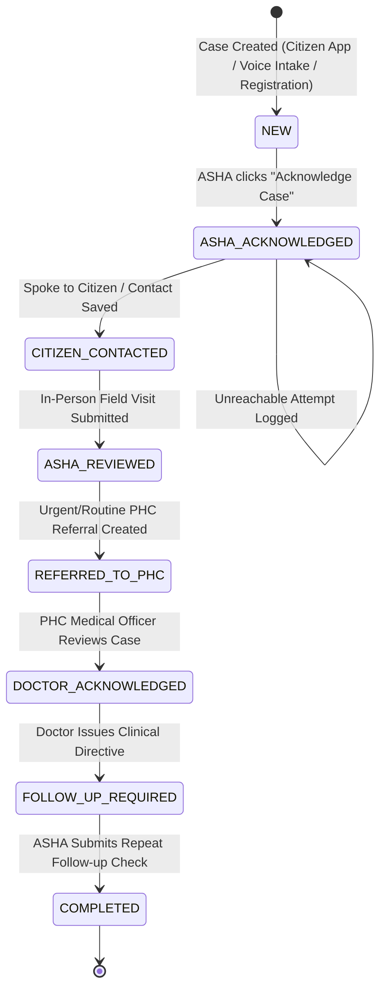

# Aarogya Sahayak — ASHA Case Lifecycle State Machine

## 1. Authoritative State Graph & Transitions

---

## 2. State Invariants & Role Access Matrix

| Case Status | Permitted Actor | Permitted Action | Triggered API Route | Next Status | UI Presentation |
|---|---|---|---|---|---|
| `NEW` | ASHA Worker | Acknowledge Assignment | `POST /asha/cases/:id/acknowledge` | `ASHA_ACKNOWLEDGED` | Primary "Acknowledge Case" button |
| `ASHA_ACKNOWLEDGED` | ASHA Worker | Spoke to Citizen | `POST /asha/cases/:id/contact-result` | `CITIZEN_CONTACTED` | "Spoke to Citizen" Modal |
| `ASHA_ACKNOWLEDGED` | ASHA Worker | Log Unreachable | `POST /asha/cases/:id/contact-result` | `ASHA_ACKNOWLEDGED` | "Unreachable" Modal (Attempt ++ ) |
| `CITIZEN_CONTACTED` | ASHA Worker | Conduct Field Visit | `POST /asha/visits` | `ASHA_REVIEWED` | 7-Step Field Visit Wizard |
| `ASHA_REVIEWED` | ASHA Worker / System | Submit PHC Referral | `POST /asha/referrals` | `REFERRED_TO_PHC` | Instant Doctor Queue Referral |
| `REFERRED_TO_PHC` | PHC Doctor | Doctor Review | `POST /doctor/referrals/:id/acknowledge` | `DOCTOR_ACKNOWLEDGED` | Doctor Referral Queue |
| `DOCTOR_ACKNOWLEDGED` | PHC Doctor | Consultation / Directives | `POST /doctor/consultations` | `FOLLOW_UP_REQUIRED` | Doctor Prescription & Instructions |
| `FOLLOW_UP_REQUIRED` | ASHA Worker | Complete Home Checkup | `POST /asha/followups/:id/complete` | `COMPLETED` | Follow-up Completion Modal |
| `COMPLETED` | All Roles | View Longitudinal History | `GET /asha/cases/:id` | None (Final State) | Read-only Audit Trail & Timeline |

---

## 3. Idempotency & Concurrency Rules
* Every POST state mutation accepts an `Idempotency-Key` header with UUIDv4.
* Re-executing an acknowledged or completed request with the same key returns the cached HTTP 200 payload and does NOT create duplicate timeline entries or duplicate database records.
