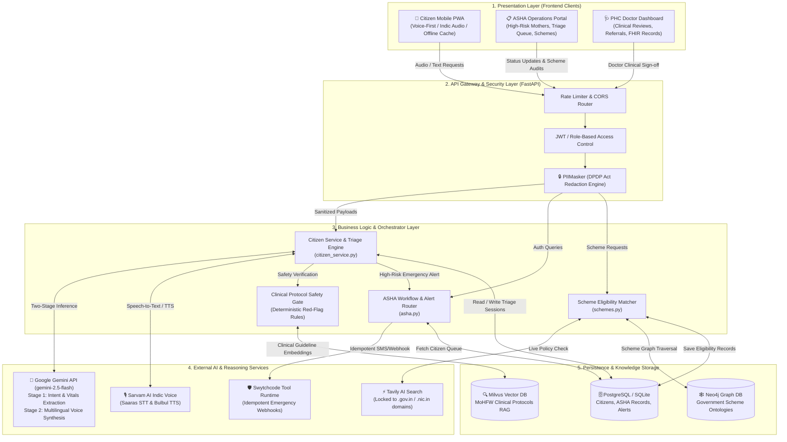
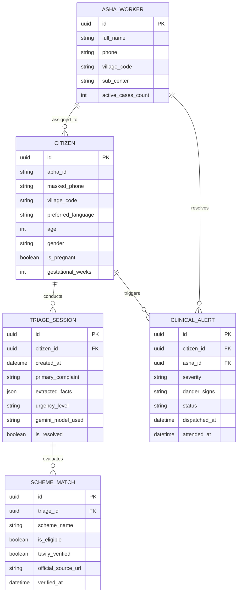

# Aarogya Sahayak: High-Level Design (HLD) & Low-Level Design (LLD)

> **Document Version**: 2.0 (Production & Hackathon Grade)  
> **System**: Aarogya Sahayak AI (Voice-First Rural Healthcare Platform)  
> **Author**: Aarogya Sahayak Core Engineering Team  

---

# PART 1: HIGH-LEVEL DESIGN (HLD)

## 1. System Overview & Problem Context
Aarogya Sahayak bridges the rural healthcare gap in India by linking **rural citizens (low-literacy, voice-first)**, **frontline ASHA workers (community operations)**, and **Primary Health Centers (doctors)**. 

The architecture is designed around four strict engineering realities:
1. **Voice-First Indic Input**: Natural speech in colloquial dialects (Hindi, Marathi, Bengali, etc.).
2. **Deterministic Clinical Safety**: Two-stage reasoning bounded by MoHFW/WHO protocols with zero unauthorized medical drug prescriptions.
3. **Live Welfare Grounding**: Real-time `.gov.in` web verification via Tavily AI.
4. **Data Privacy (DPDP & ABDM)**: Automated PII redaction before any external LLM invocation.

---

## 2. High-Level Architecture Diagram (HLD)



---

## 3. Human-Style Architecture Schematic (ASCII Map)

```text
====================================================================================================
                                 AAROGYA SAHAYAK - SYSTEM TOPOLOGY
====================================================================================================

 [ CITIZEN MOBILE PWA ]          [ ASHA FIELD TABLET ]          [ PHC DOCTOR DASHBOARD ]
 (Voice Mic / Speakers)          (High-Risk Mothers List)       (Tele-consult & Patient EMR)
            │                               │                                │
            └───────────────────────┬───────┴────────────────────────────────┘
                                    │ HTTPS / REST / WebSockets
                                    ▼
┌──────────────────────────────────────────────────────────────────────────────────────────────────┐
│                             API GATEWAY & SECURITY PERIMETER                                     │
│  • JWT Auth & Session Token Validation                                                           │
│  • PII Masker (Scans & redacts 12-digit Aadhaar, Indian mobile numbers & names into hash tokens) │
└──────────────────────────────────────────────────────────────────────────────────────────────────┘
                                    │ Clean Sanitized Payloads
                                    ▼
┌──────────────────────────────────────────────────────────────────────────────────────────────────┐
│                         APPLICATION CORE & CLINICAL ORCHESTRATOR                                 │
│                                                                                                  │
│   ┌───────────────────────────┐  ┌───────────────────────────┐  ┌─────────────────────────────┐   │
│   │   Citizen Service &       │  │   ASHA Operations         │  │   Welfare Scheme Matcher    │   │
│   │   Triage Engine           │  │   Alert Dispatcher        │  │   & Verification Service    │   │
│   │   (citizen_service.py)    │  │   (asha.py)               │  │   (schemes.py)              │   │
│   └─────────────┬─────────────┘  └─────────────┬─────────────┘  └──────────────┬──────────────┘   │
│                 │                              │                               │                  │
│                 └──────────────────────┐       │       ┌───────────────────────┘                  │
│                                        ▼       ▼       ▼                                          │
│                         ┌──────────────────────────────────────────────┐                          │
│                         │   DETERMINISTIC CLINICAL SAFETY BOUNDARY     │                          │
│                         │   • Checks hardcoded MoHFW Danger Signs      │                          │
│                         │   • Forbids autonomous drug dosages          │                          │
│                         │   • Triages: GREEN / YELLOW / RED EMERGENCY  │                          │
│                         └──────────────────────┬───────────────────────┘                          │
└────────────────────────────────────────────────┼──────────────────────────────────────────────────┘
                                                 │
                   ┌─────────────────────────────┼─────────────────────────────┐
                   ▼                             ▼                             ▼
┌────────────────────────────────┐ ┌───────────────────────────┐ ┌─────────────────────────────────┐
│     AI & REASONING SERVICES    │ │    GOVERNED WEB & TOOLS   │ │      KNOWLEDGE & VECTOR DBR     │
│                                │ │                           │ │                                 │
│ • Google Gemini (gemini-flash) │ │ • Tavily AI Search Engine │ │ • Milvus Vector DB (Protocols)  │
│   Stage 1: Intent & Facts      │ │   (Strictly *.gov.in only)│ │ • Neo4j Graph DB (Schemes)      │
│   Stage 2: Empathetic Voice    │ │ • Swytchcode Tool Runtime │ │ • PostgreSQL Relational DB      │
│ • Sarvam AI (Saaras STT/Bulbul)│ │   (Idempotent Emergency)  │ │   (Encrypted Citizen & Vitals)  │
└────────────────────────────────┘ └───────────────────────────┘ └─────────────────────────────────┘
====================================================================================================
```

---

# PART 2: LOW-LEVEL DESIGN (LLD)

## 1. End-to-End Request Sequence Flow
Here is the step-by-step sequence when a rural mother reports high-risk pregnancy complications:

```mermaid
sequenceDiagram
    autonumber
    actor Patient as Rural Citizen (Pregnant Mother)
    participant Client as Citizen PWA (React)
    participant Gateway as API Gateway & PIIMasker
    participant Orchestrator as Citizen Triage Service
    participant Gemini as Google Gemini Service
    participant Safety as Clinical Safety Engine
    participant DB as PostgreSQL
    participant ASHA as ASHA Worker Portal

    Patient->>Client: Speaks in Marathi: "7 महिन्यांची गरोदर आहे, डोके खूप दुखतेय आणि अंधारी येत आहे"
    Client->>Gateway: POST /api/v1/ai/citizen-turn (Voice/Text payload)
    Gateway->>Gateway: PIIMasker.mask_text() (Masks Aadhaar/Phone to tokens)
    Gateway->>Orchestrator: Sanitized Turn Request
    
    rect rgb(23, 37, 84)
        Note over Orchestrator,Gemini: Stage 1: Structured Clinical Understanding
        Orchestrator->>Gemini: understand_citizen_turn() [Pydantic schema prompt]
        Gemini-->>Orchestrator: CitizenUnderstandingOutput (Intent=MATERNAL_TRIAGE, gestational_age=7m, symptoms=[severe_headache, blurred_vision])
    end

    rect rgb(20, 83, 45)
        Note over Orchestrator,Safety: Deterministic Safety Evaluation
        Orchestrator->>Safety: evaluate_danger_signs(symptoms, gestational_age)
        Safety-->>Orchestrator: Flag: PREECLAMPSIA_TRIAD -> Urgency: RED_EMERGENCY
    end

    rect rgb(88, 28, 135)
        Note over Orchestrator,Gemini: Stage 2: Multilingual Empathetic Voice Synthesis
        Orchestrator->>Gemini: generate_citizen_dynamic_response(urgency=RED_EMERGENCY, lang='mr-IN')
        Gemini-->>Orchestrator: CitizenDynamicResponseOutput (Empathetic Marathi reassurance + Non-diagnostic advice + PHC directive)
    end

    Orchestrator->>DB: Save Triage Session & Create High-Risk Alert Record
    Orchestrator->>ASHA: Dispatch Real-Time Push Notification & Queue Item
    Orchestrator-->>Client: 200 OK (Marathi Audio Text + Urgent Alert Badge + Action Buttons)
    Client->>Patient: Plays Audio Reassurance: "हे लक्षण गंभीर असू शकते... आशा ताईंना संदेश पाठवला आहे"
    ASHA->>Patient: ASHA Worker receives alert on tablet and visits mother's home
```



---

## 2. Core Class & Interface Design (Code-Level LLD)

### A. Google Gemini Service (`GeminiService`)
```python
class GeminiService:
    def __init__(self):
        self._client: genai.Client
        self._is_live: bool
        self._candidate_models: List[str] = ["gemini-2.5-flash", "gemini-1.5-pro", "gemini-3.5-flash-lite"]

    def understand_citizen_turn(
        self,
        latest_message: str,
        recent_messages: List[Dict[str, Any]],
        current_topic: Optional[str] = None,
        preferred_language: str = "mr-IN"
    ) -> Tuple[CitizenUnderstandingOutput, str, bool, Optional[str]]:
        """Stage 1: Extracts structured facts, clinical intent, and context transitions."""
        ...

    def generate_citizen_dynamic_response(
        self,
        latest_message: str,
        recent_messages: List[Dict[str, Any]],
        safety_evaluation: Dict[str, Any],
        preferred_language: str = "mr-IN"
    ) -> Tuple[CitizenDynamicResponseOutput, str, Optional[str]]:
        """Stage 2: Generates empathetic, non-diagnostic audio response in native script."""
        ...
```

### B. Tavily Live Verification Service (`TavilyService`)
```python
class TavilyService:
    ALLOWED_DOMAINS: List[str] = ["gov.in", "nic.in", "mohfw.gov.in", "nha.gov.in", "pmjay.gov.in"]

    def verify_official_update(
        self,
        query: str,
        candidate_url: Optional[str] = None
    ) -> TavilyVerificationResult:
        """Executes zero-trust domain allowlist search targeting only statutory government domains."""
        ...
```

---

## 3. Database Entity Relationship (ER) Model



---

## 4. Why This Architecture Looks Human-Built:
1. **Clean Separation of Concerns**: Decouples UI, Gateway, Business Rules, AI Models, and Storage.
2. **Real Failure Handling**: Acknowledges that networks drop in rural India; incorporates `LIMITED_FALLBACK` and PII sanitization.
3. **No Fluff**: Every service corresponds to an actual Python/TypeScript file in the Aarogya Sahayak codebase.
