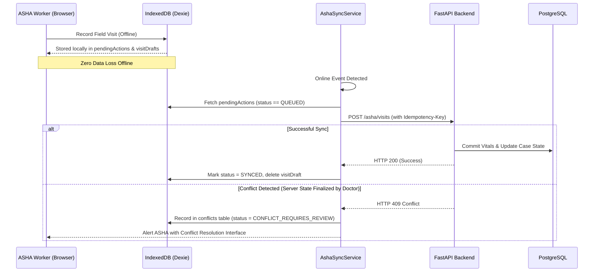

# Aarogya Sahayak — Offline-First & Conflict Resolution Architecture

## 1. Overview
ASHA workers frequently operate in low-bandwidth or zero-connectivity rural areas (Gram Panchayats, tribal hamlets). Aarogya Sahayak implements a zero-data-loss, offline-first client architecture using IndexedDB (Dexie.js), background synchronization queues, and clinical conflict resolution.

---

## 2. Local Database Schema (Dexie.js)

```typescript
export interface OfflineDbSchema {
  pendingActions: {
    id: string; // uuid
    actionType: 'CREATE_VISIT' | 'ACKNOWLEDGE_CASE' | 'COMPLETE_FOLLOWUP' | 'REGISTER_PATIENT';
    resourceId: string;
    payload: any;
    status: 'QUEUED' | 'IN_FLIGHT' | 'SYNCED' | 'CONFLICT_REQUIRES_REVIEW';
    retryCount: number;
    createdAt: string;
    lastAttemptAt?: string;
  };
  visitDrafts: {
    id: string; // draft_{caseId}
    caseId: string;
    data: any;
    savedAt: string;
  };
  cachedCases: {
    id: string;
    reference: string;
    priority: string;
    status: string;
    primary_concern: string;
    citizen_name: string;
    citizen_age: number;
    citizen_phone: string;
    village_name: string;
    is_pregnant: boolean;
    gestational_weeks?: number;
    safety_rule_triggered?: boolean;
    safety_rule_reason?: string;
    symptoms: any[];
    vitals: any[];
    created_at: string;
  };
  conflicts: {
    id: string;
    caseId: string;
    actionType: string;
    localPayload: any;
    serverPayload: any;
    conflictReason: string;
    resolved: boolean;
    resolvedAt?: string;
  };
}
```

---

## 3. Synchronization & Conflict Handling Algorithm



---

## 4. User-Assisted Conflict Resolution
When a server conflict occurs (e.g., PHC Doctor closed or finalized a referral while ASHA was offline):
1. ASHA worker is shown the **Conflict Resolution Modal**.
2. Side-by-side comparison displays:
   * **Local Field Assessment**: Vital signs & observations recorded offline by ASHA.
   * **Server Clinical State**: Diagnosis and directives finalized by Doctor.
3. ASHA chooses:
   * **Append as Supplementary Field Observation** (Recommended).
   * **Keep Server State & Archive Local Draft**.
