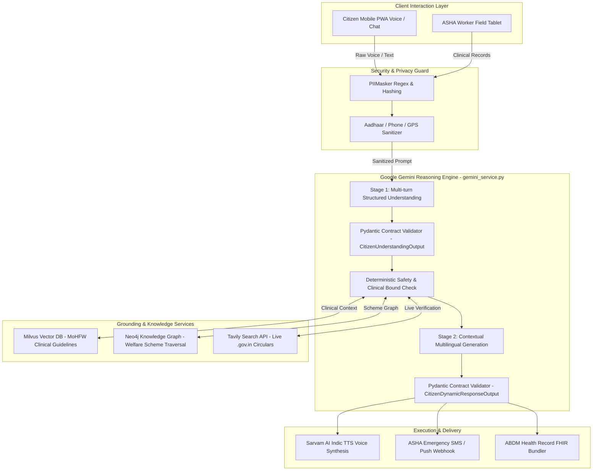
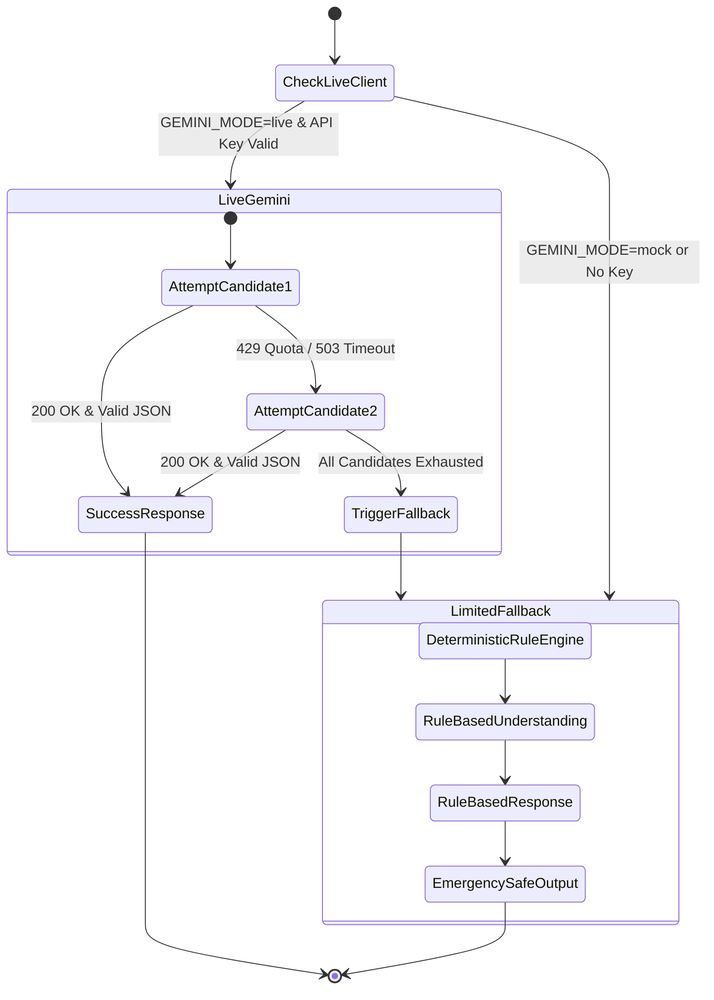

# Google Gemini Integration Architecture & Technical Specification

This document provides the exhaustive technical architecture for the **Google Gemini Multimodal Reasoning Engine** integrated into **Aarogya Sahayak**.

---

## 1. System Topology & Multi-Agent Fusion

Aarogya Sahayak uses a layered, multi-agent architecture where Google Gemini functions as the high-level cognitive reasoning layer, bounded by deterministic safety engines, vector databases, and knowledge graphs.



---

## 2. Two-Stage Reasoning Pipeline Implementation

The integration is encapsulated within [`backend/app/ai/providers/gemini_service.py`](file:///c:/Users/princ/Downloads/AarogyaSahayak-main/AarogyaSahayak-main/backend/app/ai/providers/gemini_service.py).

### Stage 1: Structured Clinical Understanding (`understand_citizen_turn`)
* **Objective**: Decouple reasoning and fact extraction from free-text generation. Convert ambiguous colloquial speech into structured clinical schemas.
* **Model Candidates**: Evaluates `gemini-2.5-flash`, `gemini-1.5-pro`, and `gemini-3.5-flash-lite` with automatic fallback.
* **Schema Contract**:
  ```python
  class CitizenUnderstandingOutput(BaseModel):
      intent: CitizenIntentEnum          # 33 verified clinical & administrative intents
      context_transition: ContextTransitionEnum # 11 state transitions
      extracted_facts: Dict[str, Any]    # Vitals, duration, danger signs, pain score
      negated_facts: List[str]           # Explicitly ruled-out symptoms
      user_goal: str                     # Plain language intention
      confidence_score: float            # 0.0 to 1.0 confidence rating
  ```
* **System Prompt Constraints**:
  - Never generate diagnosis or drug prescriptions.
  - Detect high-risk maternal and pediatric red flags immediately.
  - Return raw JSON conforming strictly to the Pydantic schema without markdown ticks.

### Stage 2: Contextual Multilingual Generation (`generate_citizen_dynamic_response`)
* **Objective**: Formulate a culturally empathetic, non-diagnostic audio script in the citizen's native language.
* **Language-Locked Generation**:
  - `mr-IN`: Native Marathi script (मराठी) without English mixture.
  - `hi-IN`: Standard Hindi script (हिंदी) in normal Devanagari.
  - `gu-IN`: Gujarati script (ગુજરાતી).
  - `bn-IN`: Bengali script (বাংলা).
  - `kn-IN`: Kannada script (ಕನ್ನಡ).
* **Schema Contract**:
  ```python
  class CitizenDynamicResponseOutput(BaseModel):
      assistant_reply: str              # Native script empathetic response
      clarifying_question: Optional[str] # Single highest-value missing clinical vital
      recommended_action: str           # Home care or immediate PHC consultation
      urgency_level: str                # GREEN, YELLOW, ORANGE, RED_EMERGENCY
      suggested_chip_actions: List[str] # Interactive quick-reply buttons for low-literacy users
  ```

---

## 3. Privacy & PII Redaction Boundary

In strict compliance with India's Digital Personal Data Protection (DPDP) Act, no raw personal identifiable information (PII) is transmitted across the Gemini API boundary.

[`backend/app/ai/pii/masker.py`](file:///c:/Users/princ/Downloads/AarogyaSahayak-main/AarogyaSahayak-main/backend/app/ai/pii/masker.py) executes deterministic sanitization before any API request:
1. **Aadhaar Numbers**: `\b\d{4}\s?\d{4}\s?\d{4}\b` $\rightarrow$ `[AADHAAR_HASH_<ID>]`
2. **Indian Mobile Numbers**: `\b(?:\+91|0)?[6-9]\d{9}\b` $\rightarrow$ `[PHONE_REDACTED]`
3. **Names & Relatives**: Cross-referenced with citizen profile state and replaced with generic role tags (`[PATIENT]`, `[MOTHER]`).
4. **GPS Coordinates**: Fuzzed to block/sub-district level to protect patient location privacy.

---

## 4. Multi-Tiered Failover State Machine (`LIMITED_FALLBACK`)

To ensure 99.99% clinical triage availability across intermittent rural mobile networks, `GeminiService` incorporates an intelligent fallback mechanism:



### Safety Properties of `LIMITED_FALLBACK`:
* **Zero System Crashes**: Returns a valid `CitizenUnderstandingOutput` and `CitizenDynamicResponseOutput` derived from local MoHFW decision trees.
* **Conservative Triage**: If an error occurs while evaluating high-risk keywords (e.g. chest pain, bleeding), the fallback engine defaults to **YELLOW/RED URGENT**, prompting the patient to visit the PHC immediately.
* **Transparent Logging**: Emits structured JSON events (`gemini_provider_fallback`, `last_error_category`) for real-time observability.
