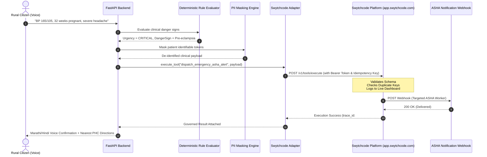

# Swytchcode Technical Integration Architecture

This document details the software architecture, data flow contracts, and runtime execution boundaries between **Aarogya Sahayak** and the **Swytchcode Platform**.

---

## 1. System Topology

```text
┌─────────────────────────────────────────────────────────────────────────────┐
│                            CITIZEN / DOCTOR UI                             │
│       (Mobile PWA / Healthcare Portal / Marathi-Hindi Voice Assistant)       │
└──────────────────────────────────────┬──────────────────────────────────────┘
                                       │ HTTPS / WebSockets
                                       ▼
┌─────────────────────────────────────────────────────────────────────────────┐
│                         AAROGYA SAHAYAK FASTAPI CORE                        │
│                                                                             │
│  ┌───────────────────────┐  ┌────────────────────┐  ┌────────────────────┐  │
│  │ Emergency Rule Engine │  │ PII Masking Engine  │  │ Multi-Agent Brain  │  │
│  │ (Deterministic Rules) │  │ (Anonymizes Vitals)│  │ (Gemini + RAG)     │  │
│  └───────────┬───────────┘  └─────────┬──────────┘  └─────────┬──────────┘  │
│              └────────────────────────┼───────────────────────┘             │
│                                       ▼                                     │
│                     SWYTCHCODE INTEGRATION ADAPTER                          │
│               (backend/app/integrations/swytchcode.py)                      │
└──────────────────────────────────────┬──────────────────────────────────────┘
                                       │ Governed Tool Invocations
                                       ▼
┌─────────────────────────────────────────────────────────────────────────────┐
│                  SWYTCHCODE PLATFORM & RUNTIME CLOUD                        │
│                    (https://api-v2.swytchcode.com)                          │
│                                                                             │
│   [Credential Vault]   [Schema Validator]   [Idempotency & Replay Cache]    │
│            │                   │                          │                 │
│            └───────────────────┴──────────────────────────┘                 │
│                                │                                            │
│                                ▼ Telemetry Stream                           │
│                 [Swytchcode Real-Time Dashboard]                            │
│                 (app.swytchcode.com/dashboard/overview)                     │
└──────────────────────┬───────────────────────────────┬──────────────────────┘
                       │                               │
                       ▼                               ▼
       ┌───────────────────────────────┐ ┌──────────────────────────────┐
       │     SARVAM AI INDIC VOICE     │ │  EMERGENCY WEBHOOK QUEUE     │
       │   - Saaras (Speech-to-Text)   │ │  - Urgent ASHA Notification  │
       │   - Bulbul (Text-to-Speech)   │ │  - PHC Doctor Emergency Desk │
       │   - Mayura (Translation)      │ │  - Ambulance Dispatch Bus    │
       └───────────────────────────────┘ └──────────────────────────────┘
```

---

## 2. Component Directory Map

| File Path | Role & Responsibilities |
|---|---|
| `backend/app/integrations/swytchcode.py` | Core Swytchcode client adapter. Handles authentication via `SWYTCHCODE_API_KEY`, tool registration, HTTP dispatch, idempotency key generation, and deterministic mock fallbacks. |
| `backend/app/integrations/sarvam.py` | Indic voice adapter wrapped by Swytchcode. Proxies audio encoding/decoding through Swytchcode's governed execution layer. |
| `backend/app/ai/orchestrator/orchestrator.py` | Multi-agent coordination pipeline. Calls Swytchcode whenever triage triggers emergency alerts or facility lookups. |
| `backend/app/routers/integrations.py` | REST API routes exposing Swytchcode status, health metrics, and manual test execution endpoints for live demos. |
| `swytchcode/tooling.json` | Declarative tool manifest declaring parameters, rate limits, and output schemas for Swytchcode runtime. |

---

## 3. Data Flow: The Governed Emergency Escalation Cycle

When a patient in a village reports symptoms indicating severe pre-eclampsia, the following sequence executes:



---

## 4. Sarvam AI Voice Integration under Swytchcode

### Why Wrap Sarvam AI in Swytchcode?
Sarvam AI provides cutting-edge Indic language models (`saaras:v3` for speech recognition and `bulbul:v3` for natural voice generation in Marathi, Hindi, and Indian English). However, rural bandwidth is prone to packet loss and high latency jitter.

### Swytchcode's Added Value to Sarvam:
1. **Circuit Breaker & Adaptive Timeout**: If a rural 2G tower lags, Swytchcode caps the request at 3,000ms and triggers pre-rendered phonetic fallbacks, ensuring the user interface never freezes.
2. **Credential Isolation**: Client applications and frontend PWAs never touch `SARVAM_API_KEY`. The key resides securely in the Swytchcode vault.
3. **Usage & Latency Telemetry**: Real-time tracking of audio conversion latency and speech-to-text confidence scores directly in the Swytchcode dashboard.

---

## 5. Security & Zero-Trust Invariants

Aarogya Sahayak adheres to five strict architectural invariants:

1. **Zero Raw Token Leakage**: The LLM reasoning model never receives API tokens in its prompt, nor does it format raw HTTP requests.
2. **Deterministic Pre-Triage**: Emergency triage rules execute deterministically **before** any AI model is consulted. Swytchcode executes the alert regardless of LLM status.
3. **Write Isolation**: Swytchcode adapters have **no direct write privileges** to the core PostgreSQL clinical database. They only interact with external communication services and return structured data to the backend application layer.
4. **Strict PII Scrubbing**: Names, 12-digit Aadhaar numbers, and raw phone numbers are replaced with cryptographic reference tokens before Swytchcode payload serialization.
5. **Idempotency Guarantee**: Every mutating external action includes a SHA-256 idempotency key:
   $$\text{Key} = \text{SHA256}(\text{case\_id} + \text{action} + \lfloor\text{timestamp} / 300\rfloor)$$
   This guarantees that retry bursts within a 5-minute window are executed once and only once.
