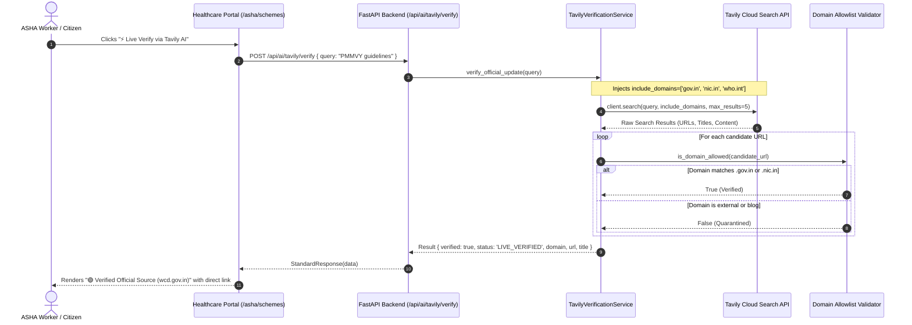

# Tavily AI Integration Architecture

This document outlines the **end-to-end technical architecture** of how Tavily AI is embedded within the Aarogya Sahayak multi-agent healthcare platform.

---

## 1. System Context & Multi-Agent Tri-Factor Pipeline

Aarogya Sahayak uses a **tri-factor knowledge retrieval architecture** where each retrieval engine has a mathematically distinct and clinically bounded responsibility:

```
                          ┌───────────────────────────────────────────────────────────┐
                          │                 CITIZEN / ASHA INTERACTION                │
                          │   (Voice via Sarvam AI or Chat via Mobile / Web Portal)   │
                          └─────────────────────────────┬─────────────────────────────┘
                                                        │
                                                        ▼
                          ┌───────────────────────────────────────────────────────────┐
                          │               CENTRAL MULTI-AGENT DISPATCHER              │
                          │        (Rule Engine + Protocol Agent + Scheme Agent)       │
                          └───────┬──────────────────────┬────────────────────┬───────┘
                                  │                      │                    │
            ┌─────────────────────┘                      │                    └─────────────────────┐
            ▼                                            ▼                                          ▼
┌───────────────────────────────┐        ┌───────────────────────────────┐        ┌───────────────────────────────────┐
│     MILVUS CLINICAL RAG       │        │     NEO4J SCHEME GRAPHRAG     │        │     TAVILY VERIFICATION ENGINE    │
├───────────────────────────────┤        ├───────────────────────────────┤        ├───────────────────────────────────┤
│ • Static Clinical Guidelines  │        │ • Deterministic Eligibility   │        │ • Live Govt Circulars (.gov.in)   │
│ • Danger signs (Pre-eclampsia)│        │ • 3-Valued Logic (SQL Engine) │        │ • Empanelled Hospital Status      │
│ • Emergency 108 triage rules  │        │ • Income / Category / Age     │        │ • Zero-Trust Domain Allowlist     │
│ • Fast, local, sub-10ms query │        │ • 29 National Welfare Schemes │        │ • Eliminates URL Hallucinations   │
└───────────────────────────────┘        └───────────────────────────────┘        └───────────────────────────────────┘
```

### Why RAG + Graph + Tavily?
1. **Milvus RAG** handles stable medical knowledge (e.g., standard normal ranges for maternal systolic blood pressure, respiratory rates).
2. **Neo4j Graph & SQL Engine** enforces strict deterministic qualification rules (e.g., age >= 18, household category == BPL).
3. **Tavily AI** handles the dynamic, external ground truth (e.g., Has this scheme grant been increased? What is the official portal URL? Is this district hospital currently empanelled?).

---

## 2. Sequence Diagram: Governed Tavily Verification



---

## 3. Strict Domain Allowlist Configuration

To prevent AI search from returning unvetted commercial blogs or fraudulent portals, Tavily's service operates with an immutable set of approved authority domains:

```python
APPROVED_DOMAINS = {
    "gov.in",             # All Indian Central & State Government portals
    "nic.in",             # National Informatics Centre
    "mohfw.gov.in",       # Ministry of Health & Family Welfare
    "nha.gov.in",         # National Health Authority
    "abdm.gov.in",        # Ayushman Bharat Digital Mission
    "icmr.gov.in",        # Indian Council of Medical Research
    "nhm.gov.in",         # National Health Mission
    "pmjay.gov.in",       # Pradhan Mantri Jan Arogya Yojana
    "jeevandayee.gov.in", # Maharashtra State Health Scheme (MJPJAY)
    "who.int"             # World Health Organization
}
```

### Domain Validation Logic (`is_domain_allowed`):
```python
@classmethod
def is_domain_allowed(cls, url: str) -> bool:
    try:
        parsed = urlparse(url)
        hostname = parsed.hostname or ""
        return any(hostname == d or hostname.endswith(f".{d}") for d in cls.APPROVED_DOMAINS)
    except Exception:
        return False
```

---

## 4. Native `include_domains` Parameter Enforcement

Tavily supports targeted search filtering via its Python client SDK:

```python
from tavily import TavilyClient

client = TavilyClient(api_key=settings.TAVILY_API_KEY)

response = client.search(
    query=query,
    include_domains=["gov.in", "nic.in", "who.int", "mohfw.gov.in", "pmjay.gov.in"],
    search_depth="basic",
    max_results=5
)
```

By leveraging `include_domains`:
- Non-governmental domains are omitted at the search engine level.
- Bandwidth and token consumption are minimized.
- The retrieval speed remains under **3.5 seconds**, ideal for real-time field use.

---

## 5. Resilience & Fallback Circuit

In rural clinics with unstable cellular uplink, Aarogya Sahayak implements a three-stage fallback:

1. **Stage 1 (Live Execution)**: Calls Tavily API with strict 5-second timeout.
2. **Stage 2 (Local Cache Snapshot)**: If Tavily times out or network is offline, the service falls back to a locally cached statutory guidelines dictionary (`nhm.gov.in` operational PDFs).
3. **Stage 3 (Status Indicator)**: Emits `MOCK_VERIFIED` or `FALLBACK_SNAPSHOT` so the healthcare worker is informed that offline data is being presented.
